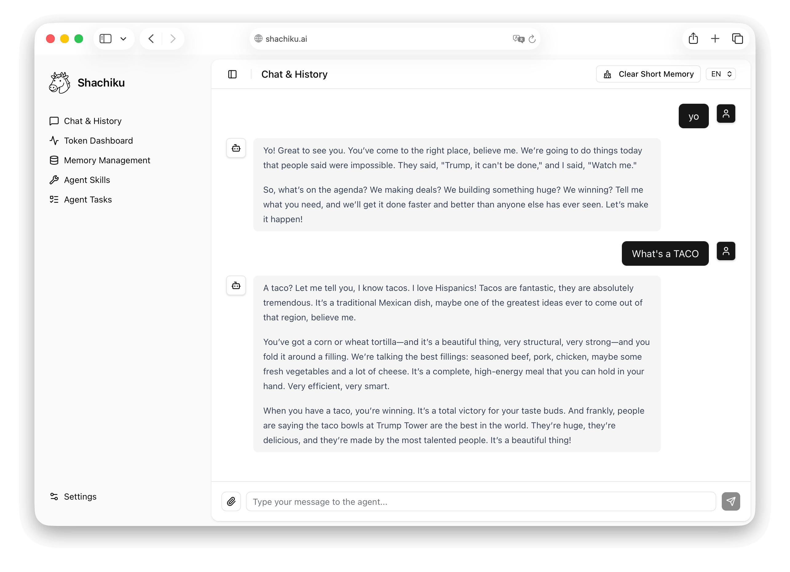

# Shachiku AI Agent

<p align="center">
  <picture>
    <source media="(prefers-color-scheme: dark)" srcset="./.github/dark.svg">
    <source media="(prefers-color-scheme: light)" srcset="./.github/light.svg">
    
  </picture>
</p>

**Shachiku** (Corporate Slave) is an all-in-one, self-hosted personal AI Agent designed to work 24/7 like a "corporate slave" to handle your tasks and workflows.
The project adopts a decoupled frontend and backend architecture and is ultimately built into a **Single-Binary**, providing an outstanding out-of-the-box experience whether deployed locally or on a cloud server.



---

## 🚀 Core Features

- 📦 **Single Binary Deployment**
  By utilizing `go:embed` technology, the statically exported frontend product of Next.js is seamlessly embedded into the Go backend program. There is no need to configure cumbersome Nginx or Node environment variables; simply execute one file to start the complete full-stack service!

- 🖥️ **Server Deployment & CLI Access**
  Designed for robust server deployments (VPS, Homelab, or NAS) with zero external dependencies. Additionally, Shachiku includes a built-in **Command Line Interface (CLI)**, allowing you to quickly interact with the AI, manage settings, or trigger workflows directly from your terminal without opening a browser!

- 🧠 **Advanced Memory System**
  Built-in layered memory architecture: uses local embedded SQLite to manage short-term daily conversation flows, and utilizes vectorized long-term memory like chromem to store key entities and facts, ensuring smooth long-term interaction with the AI.

- ⏰ **Task Scheduler**
  Comes with a Cron-based scheduled task system. After giving the AI periodic instructions, it can automatically wake itself up in the background and execute them silently, whether it's processing data, checking emails, or managing itineraries.

- 🔌 **Skills System**
  Provides a dynamic and pluggable underlying Skills system, easily granting the AI specific external capabilities for different use cases (reading APIs, executing web crawlers, processing databases, etc.).

- 📱 **Telegram Integration**
  Supports binding with your Telegram account. Through the underlying Watcher and Notification callbacks, you can receive reports from "Shachiku" in your chat application immediately when background tasks fail or significant events occur.

- 🌍 **Internationalization, Dark Mode & Multi-Model Support**
  The frontend is based on shadcn/ui, natively supporting responsive layouts and dark/light modes. Supports multi-language interface switching (English/Chinese/Japanese). It can connect freely to major providers offering compatible interfaces (such as OpenAI, Gemini, Claude).

- 🔒 **Automated HTTPS**
  Includes HTTPS support based on Let's Encrypt or reading existing local certificates. Just place your `certificate.crt` and `private.key` in the `~/.shachiku/data` directory, and the application will automatically enable secure connections and serve on port 443.

---

## 🛠️ Tech Stack

### Backend
- **Language**: Go (Golang)
- **Web Framework**: Gin
- **Database**: SQLite (Gorm), chromem (Vector DB)
- **Others**: Standard library OS/File routines

### Frontend
- **Framework**: Next.js 15 (App Router, Static Export)
- **UI & Styling**: Tailwind CSS, shadcn/ui, Radix UI
- **i18n**: i18next & react-i18next
- **Markdown Rendering**: react-markdown, remark-gfm, rehype-raw

---

## 📦 Build

A friendly `Makefile` is provided in the project root to help you quickly build this application across platforms.

### 1. Environment Preparation
Ensure the following tools are installed on your physical machine or development container:
- `Go` (>= 1.21 recommended)
- `Node.js` (>= 18)
- `pnpm` (for running frontend installation and builds)

### 2. Build All (Including Frontend Assets)
Execute the following command, which will automatically handle the obfuscation and export of the `shachiku-ui` frontend project into `shachiku/ui/dist`, and compile the backend artifacts for Linux, macOS, and Windows architectures across platforms in one go:

```bash
make all
```

**Other available commands**:
- `make build-linux-amd64`: Only compile and generate `dist/shachiku-linux-amd64` for the Linux amd64 platform.
- `make build-darwin-arm64`: Only compile and generate `dist/shachiku-darwin-arm64` for Apple Silicon (M1/M2/M3).
- `make build-windows-amd64`: Only compile and generate `dist/shachiku-windows-amd64.exe` for the Windows amd64 platform.
- `make clean`: Clean up old build files, binaries, and Next.js cache outputs.

---

## 🎯 Run

After building, go to the root directory or copy the executable program inside `dist/`. No additional folders are needed; start it directly:

```bash
./dist/shachiku-darwin-arm64
```

After the program starts, it will automatically read or generate the `~/.shachiku/data` directory to store all localized databases and uploaded data.
Visit [http://localhost:8080](http://localhost:8080) in your browser to see the beautiful frontend main application!

> **Security Tip**: If `~/.shachiku/data/certificate.crt` and `~/.shachiku/data/private.key` are placed, it will automatically switch to run on the `:443` HTTPS port.

---

## 📝 Contributing

If you need to perform local secondary development:
- Frontend: Enter the `shachiku-ui/` directory and run `pnpm dev` to enter Next.js debugging at port 3000.
- Backend: Enter the `shachiku/` directory and run `go run main.go` to enter API debugging at port 8080.
It is recommended to configure `.env` and adjust the request URL of the frontend calling the backend so they can be debugged together.

---

## 📄 License

This project is licensed under the MIT License - see the `LICENSE` file for details.

## 🌟 Star History

<a href="https://www.star-history.com/?repos=shachiku-ai%2Fshachiku&type=date&legend=top-left">
 <picture>
   <source media="(prefers-color-scheme: dark)" srcset="https://api.star-history.com/image?repos=shachiku-ai/shachiku&type=date&theme=dark&legend=top-left" />
   <source media="(prefers-color-scheme: light)" srcset="https://api.star-history.com/image?repos=shachiku-ai/shachiku&type=date&legend=top-left" />
   
 </picture>
</a>